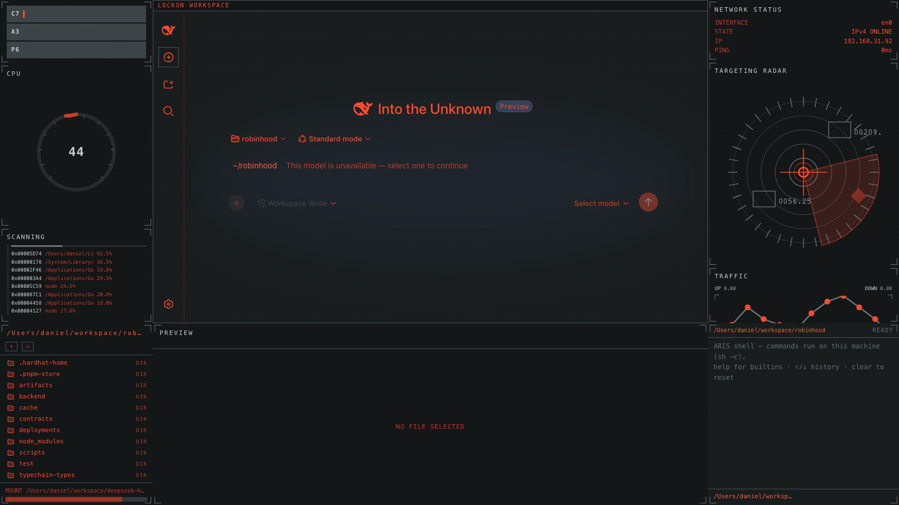
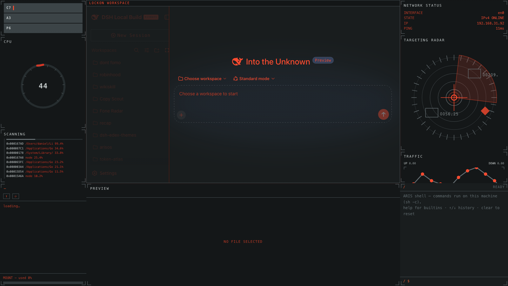

# dsh-edex-lockon-ui

**DeepSeek Harness eDEX-UI shell plugin — LOCKON theme** — a terminal-inspired
eDEX-UI overlay for the DSH web GUI, themed after a tactical targeting HUD:
near-black `#0c0e0d` canvas, cool dark-gray `#181c1d` panel surfaces, an
orange-red `#ff4b2f` accent reserved for active indicators, and gray
`#697276` corner-bracket card frames with no glow.





## Features

- **Left bar** — a targeting stack: **C7 / A3 / P6 selector blocks** (three
  operator-selector tiles with an orange active indicator), a circular **CPU
  gauge** (red active arc + tick marks + center value), and **SCANNING**
  telemetry (dense hex-address rows with a vertical striped meter and a
  progress bar)
- **Right bar** — network status, the featured **TARGETING RADAR** (a radar
  display replacing the world-view globe: concentric rings, a rotating sweep,
  crosshair, target bracket markers, and a blinking orange alert marker), and
  a **TRAFFIC** angular line chart with orange node markers
- **Bottom panel** — filesystem browser, file preview/editor, and a real host
  terminal, sharing the same gray corner-bracket card chrome
- **Terminal-styled composer** — flattened input capsule, orange block caret,
  and a `~/<workspace>` path prompt at the left edge of the input area
- **Workspace-follow** — the dir panel and prompt track the active
  conversation's workspace
- **LOCKON skin** — token overrides recolour the entire original UI: orange-red
  accent, `#181c1d` panel surface shared by the workspace and side panels, gray
  technical frame lines

## Theme

| Token | Value |
|---|---|
| Accent | `#ff4b2f` |
| Background | `#0c0e0d` |
| Panel surface | `#181c1d` |
| Card fill | `#131617` |
| Frame / border | `#465054` |
| Bracket color | `#697276` |
| Text | `#c8cece` |
| Success / warn | `#ff6338` |
| Error | `#d93624` |

Border language: thin gray corner brackets at each card's corners (partial
segments, not closed rectangles), 0px radius, no glow — the reference's
technical-line aesthetic.

## Installation

The plugin is published to npm as `@danielng23/dsh-edex-lockon-ui`. From the
harness checkout:

```sh
pnpm dsh plugin --profile web add @danielng23/dsh-edex-lockon-ui
pnpm dsh web   # serves the LOCKON-themed shell over the default GUI
```

To run the local checkout instead of the npm release (for development), add
the bundle with a `file:` path:

```sh
pnpm dsh plugin --profile web add file:/Users/daniel/workspace/dsh-edex/dsh-edex-lockon-ui/packages/bundle
```

## Development

```sh
./scripts/link-harness.sh   # link @deepseek-ai/* + @danielng23/* from the harness
./scripts/build.sh          # build every plugin package (lib/index.js + lib/client.js)
```

Widgets live in `packages/ui-edex/src/client/{left-bar,right-bar,bottom-panel}/widgets/`
and are composed in the `*_WIDGETS` registries of the bar modules — swap a
widget by editing one registry line.
